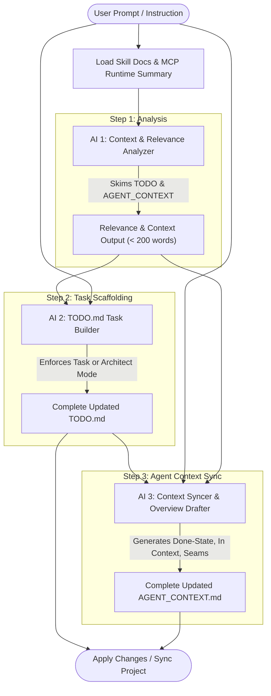

# Ergo AI Step Logic & Workflow Architecture

This document details the step-by-step logic, data flow, context boundaries, and agent handoffs for both core AI pipelines in Ergo:
1. **The Human AI Assistant Pipeline** (`runHumanAiAssistant`) — Workspace drafting, task structuring, and context synchronization.
2. **The Task Execution Pipeline** (`executeTaskWithAi`) — The 3-stage execution engine invoked when running a task.

---

## 1. Human AI Assistant Pipeline (`runHumanAiAssistant`)

The Human AI Assistant uses a **3-agent sequential pipeline** to translate user intent into structured markdown across `TODO.md` (human view) and `AGENT_CONTEXT.md` (agent view), following the core principle: **Human-Side First**.



### Modes of Operation
- **Task Mode (Default):** Strict single-task isolation. Fleshes out one selected or newly created task with concrete domain subtasks without touching or reordering any other tasks in `TODO.md`.
- **Architect Mode:** Broad roadmap planning. Assumes a higher-level scope, generating or reorganizing multiple categories, tasks, and sequential milestones.

---

### Step 1: AI 1 — Context & Relevance Analyzer (`assistant-context-analyzer`)
- **Role:** Fast, read-only reconnaissance.
- **Model Target:** Discovery model (e.g. `gpt-4o-mini`, `claude-3-5-haiku`, `gemini-2.5-flash`, or `llama3.2`).
- **Inputs & Context:**
  - Full current `TODO.md` and `AGENT_CONTEXT.md` content.
  - Active MCP connections list and allowed directory boundaries (`getAllowedRoots`).
  - Dedicated skill instructions (`skills/assistant-context-analyzer/SKILL.md`).
  - The raw user prompt.
- **Execution Logic:**
  - Scans categories, task numbers, existing subtasks, and briefs to identify structural patterns to mirror.
  - Identifies the target category and computes next task numbers.
  - Identifies relevant connected MCP tools that can help fulfill the task.
- **Output:** A strict, concise brief (< 200 words) detailing relevance, target category, numbering, constraints, and tool candidates.

---

### Step 2: AI 2 — TODO.md Task Builder (`assistant-todo-builder`)
- **Role:** Crafts the human-facing task list in native markdown.
- **Model Target:** Primary/General model (e.g. `gpt-4o`, `claude-3-7-sonnet`, `gemini-1.5-pro`, `qwen2.5-coder`).
- **Inputs & Context:**
  - Current `TODO.md`.
  - User prompt + AI 1 Context & Relevance Analysis.
  - Dedicated skill instructions (`skills/assistant-todo-builder/SKILL.md`).
- **Execution Logic:**
  - Implements **Human-Side First**: Full functional details and subtasks live in `TODO.md`.
  - Applies strict formatting: 4-space indented subtasks (`    - `), numbered lists restarting per category (`1.`, `2.`), markdown headings (`## Category`), and `~~` strikethroughs for done items.
  - Strictly prevents generic filler subtasks (e.g., forbids *"Research and plan..."* in favor of concrete domain steps).
- **Output:** The complete updated `TODO.md` document inside a fenced code block (`markdown:TODO.md`).

---

### Step 3: AI 3 — AGENT_CONTEXT.md Syncer & Overview Drafter (`assistant-context-syncer`)
- **Role:** Synchronizes the agent's technical overview and counterpart records.
- **Model Target:** Primary/General model.
- **Inputs & Context:**
  - Current `AGENT_CONTEXT.md`.
  - Newly generated `TODO.md` (from AI 2).
  - User prompt + AI 1 Context Analysis.
  - Dedicated skill instructions (`skills/assistant-context-syncer/SKILL.md`).
- **Execution Logic:**
  - Ensures exact 1:1 numerical and title parity (`### N. Title`) matching the new `TODO.md`.
  - Drafts rich, structured `Overview` sections for new or modified tasks, covering:
    - **Done-State:** Concrete completion criteria matching subtasks.
    - **In Context:** Relationship to other tasks, dependencies, and workspace architecture.
    - **Seams:** Specific files, APIs, and connected MCP tools involved.
  - Preserves unmodified sections and leaves `Build & Verification` / `Completion` ready for the execution phase.
- **Output:** The complete updated `AGENT_CONTEXT.md` document inside a fenced code block (`markdown:AGENT_CONTEXT.md`).

---

## 2. Task Execution Pipeline (`executeTaskWithAi`)

When a user clicks **Run Task** on an individual task item (without an active CLI PTY agent), Ergo initiates the **3-step execution pipeline**.

```mermaid
flowchart TD
    RunTask([Run Task Triggered]) --> Step1[Step 1: Discovery AI]
    
    subgraph Discovery [Step 1: Context Relevance Scan]
        Step1 -->|Ingests Task Header Index only| HeaderIndex["Task Header Index (Active + Archived)"]
        HeaderIndex --> RelevanceJson["JSON: { relevantTaskIds, reasoning }"]
    end
    
    RelevanceJson --> Step2[Step 2: Builder AI]
    
    subgraph Execution [Step 2: Task Execution & MCP Loop]
        Step2 -->|Targeted Context Only| BuilderContext["Targeted Context:\n- Current Task & Brief\n- Relevant Tasks Data\n- MCP Tools & Roots"]
        BuilderContext --> ProviderBranch{Provider Engine}
        ProviderBranch -->|Anthropic / OpenAI / Gemini| ToolLoop[Native MCP Tool Call Loop\n(Max 8 Rounds)]
        ProviderBranch -->|Ollama with Tool Calling| ToolLoop
        ProviderBranch -->|Ollama without Tool Calling| WorkerPattern[Ollama Worker AI Pattern\nPlan -> Worker AIs -> Synthesis]
        ToolLoop --> BuilderSummary[Builder Output & Tool Call Log]
        WorkerPattern --> BuilderSummary
    end
    
    BuilderSummary --> Step3[Step 3: Logger AI]
    
    subgraph Logging [Step 3: Completion Record]
        Step3 -->|JSON Schema Prompt| FinalJson["JSON:\n{ buildAndVerification, completion }"]
        FinalJson --> Persist["Mark Task DONE\nAppend Records to AGENT_CONTEXT.md"]
    end
```

---

### Step 1: Discovery AI (Context Relevance Scan)
- **Objective:** Find applicable knowledge from other workspace tasks (including completed and archived tasks) without reading the entire repository or entire context documents.
- **Token Efficiency Safeguard:** Does **NOT** ingest full `TODO.md` or `AGENT_CONTEXT.md`.
- **Context Provided:**
  - A lightweight **Task Header Index** containing `#N. Title (Category) [ARCHIVED] [DONE]` and truncated overview snippets (~150 chars).
  - Target task title, category, and subtasks.
- **Execution Logic:**
  - Calls `callAiEngine` with `taskType: 'discovery'`, `responseFormat: 'json'`.
  - Determines if any prior tasks contain architectural decisions, shared schemas, or dependencies relevant to the current task.
- **Output:**
  ```json
  {
    "relevantTaskIds": [2, 5],
    "reasoning": "Task #2 established the database schema used by this endpoint."
  }
  ```
- **Handoff:** Ergo extracts the *full* data only for the identified relevant task IDs to pass forward to Step 2.

---

### Step 2: Builder AI (Task Actions & MCP Integration)
- **Objective:** Execute the core work for the task using connected MCP tools and connections.
- **Strict Filesystem Boundaries:**
  - The AI has access **ONLY** to write files within the `.ergo` directory (`~/.ergo`) or folders explicitly permitted under **Connections -> Allowed Folders**.
  - Writing to the app's codebase repository or outside approved boundaries is strictly forbidden and rejected at the MCP host gateway with HTTP 403.
  - All project files, generated scripts, and artifacts live under `.ergo` (`projects/<project-id>/...`) or permitted external folders.
- **Interactive Mid-Build Human Clarification (`ask_human` Tool):**
  - All providers have access to the built-in `ask_human` tool (`{ question: string, options?: string[], context?: string, allowFreeform?: boolean }`).
  - When the Builder AI is missing critical information, credentials, or faces architectural forks, it invokes `ask_human`.
  - **Human Side:** The task card displays an amber, pulsing **Needs Input** indicator badge (`.task-needs-input-badge-pill`) and highlights the card.
  - **AI Side:** `BriefPane` and `ExecutionModal` render a Claude Code-style interactive prompt card (`.ai-human-input-card`) offering selectable option buttons, free-form text input, and Ctrl+Enter keyboard submission.
  - Submitting returns the user's answer directly back to the Builder loop as a tool result and resumes execution.

- **Execution Logic by Provider:**

#### A. Anthropic (`runAnthropicBuilderLoop`)
- Uses Anthropic's native `tool_use` API.
- Converts MCP servers into Anthropic `input_schema` tools, injecting `ask_human`.
- Evaluates tool calls up to 8 conversation rounds. Handles permission prompts (`onRequestPermission`), human clarification prompts (`onRequestHumanInput`), executes via `callMcpTool`, feeds `tool_result` blocks back into the stream, and emits real-time `ExecutionStep` updates to the UI.

#### B. OpenAI (`runOpenAiBuilderLoop`)
- Uses OpenAI function calling (`tools: [{ type: "function", function: ... }]`).
- Loops through `tool_calls` responses, executes tools against local MCP servers or intercepts `ask_human`, and posts back `tool` message roles.

#### C. Gemini (`runGeminiBuilderLoop`)
- Uses Gemini `functionDeclarations` and processes `functionCall` / `functionResponse` part structures.

#### D. Ollama (`runOllamaBuilderLoop` & `runOllamaWorkerPattern`)
- First attempts native OpenAI-compatible tool calling with `ask_human`.
- **Worker AI Fallback:** If the local model does not return tool calls (lacks tool-calling capabilities):
  1. **Plan:** Main AI breaks down the task into a numbered list of concrete work items.
  2. **Workers:** Spawns separate worker AI calls for each work item with task context.
  3. **Synthesis:** Main AI aggregates worker results and outputs a consolidated completion summary.
  4. Flags `usedWorkerPattern = true` so Step 3 can document the lack of direct tool access.

---

### Step 3: Logger AI (Completion Recording, Artifacts, & Human Review Evaluation)
- **Objective:** Generate formal build documentation, list all created/modified files with direct IDE open links, evaluate human review requirements, and append records to `AGENT_CONTEXT.md` and `TODO.md`.
- **Inputs & Context:**
  - Current Task metadata, original subtasks, and human review flags.
  - Builder AI's execution summary.
  - Full tool call log and created files list (`builderResult.createdFiles`).
  - Existing Overview.
  - If Ollama worker pattern was used: an automated note explaining the fallback.
- **Execution Logic & Evaluation:**
  - Evaluates whether the user needs to inspect or verify changes at the end (for higher-order/complex tasks, sensitive architectural changes like auth, DB, payments, deletion, or tasks explicitly flagged for human review).
  - Collects all created/modified files and presents them in `createdFiles` and the completion markdown.
  - Returns strict JSON:
    ```json
    {
      "buildAndVerification": "Markdown detailing implementation journey and checks...",
      "completion": "Markdown detailing completion summary, what was built, and list of completed files...",
      "createdFiles": ["projects/sample/src/auth.ts", "projects/sample/README.md"],
      "needsHumanReview": true,
      "humanReviewSteps": ["Verify updated DB schema migrations", "Confirm payment webhook endpoint responds 200 OK"]
    }
    ```
- **Clickable File Links & IDE Integration:**
  - In `AGENT_CONTEXT.md` / `BriefPane` Section 3 (Completion), all created files and code artifacts are rendered in an interactive **Completed Work & Created Files** panel.
  - Clicking **"Open in IDE"** directly opens the file in the user's IDE (VS Code, Cursor, or system editor via `POST /api/files/open`).
  - Markdown links to files (`[filename](path)`) in the completion notes can also be clicked to open directly in the user's IDE.
- **Persistence & State Update:**
  - Regular executed subtasks are marked `isDone: true`.
  - Human review subtasks are output as `    - **human review** - <step>` with `isDone: false, isHumanReview: true`.
  - If human review steps exist, task status is set to `'partly_done'` with a dedicated **Human Review** purple badge in `TaskPane` and a verification checklist card in `BriefPane`.
  - If no human review is required, task is marked `'done'` (`isDone: true`).
  - Updates `AGENT_CONTEXT.md` with the new `Build & Verification` and `Completion` sections (including human review and artifacts list).
  - Persists both files to local workspace storage and syncs the UI.

---

### Offline / Fallback Execution (`runOfflineExecution`)
When no AI provider is configured (`provider: 'none'` or missing API keys):
- Ergo runs a deterministic step simulator that walks through the 5 UI stages (`Reading Context` → `Executing MCP Tool` → `Executing Subtasks` → `Rendering Widget Preview` → `Updating Markdown Files`).
- Preserves explicit `**human review**` subtasks, triggers simulation for interactive questions when tasks request clarification, and maintains UI responsiveness.
