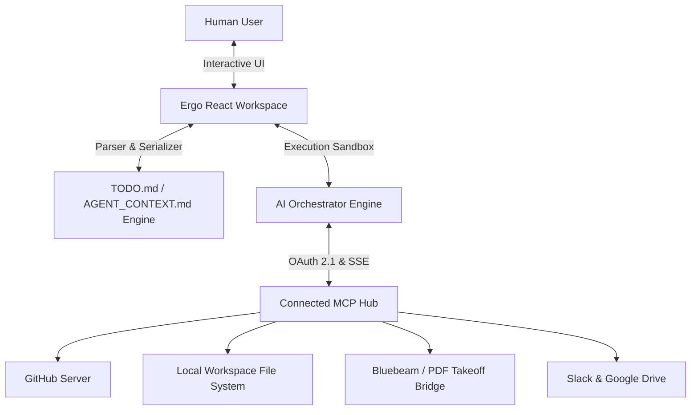

# Ergo: AI Task Workspace & Dual-File Context Engine

Ergo is a unified visual workspace designed for human-AI pair development and project execution. It functions as a lightweight task dashboard and Model Context Protocol (MCP) host, implementing the dual-layer documentation strategy (`TODO.md` for human scannability and `AGENT_CONTEXT.md` for verbose agent execution briefs).

---

## 🌟 Key Capabilities & Features

### 1. Dual-Layer Architecture (Bi-Directional Sync)
- **Human View (`TODO.md`)**: Scannable, item-numbered task roadmap grouped by category headers, subtask checklists, and `human review` flags.
- **Agent View (`AGENT_CONTEXT.md`)**: Verbose technical briefs matching item numbers, containing **Brief** (done-state & target code seams), **Built** (build records), **Validation** (test results), and **Follow-ups**.
- **Real-time Synchronization**: Checking off tasks, editing briefs, drafting with AI, or modifying raw markdown instantly updates both layers in real time.

### 2. Bring-Your-Own-MCP Ecosystem (BYO-MCP)
- Connection manager for external MCP servers over **OAuth 2.1 PKCE** and **SSE endpoints**.
- Pre-configured MCP integrations for **GitHub**, **Local File System**, **Bluebeam/PDF Takeoff Bridge**, **Slack**, **Google Workspace**, **Figma**, **Amplitude**, and **Neon/Supabase Databases**.
- Granular security controls allowing users to set **Auto-Approve** vs **Ask Permission** for individual MCP tools.

### 3. AI Skill 1: `draftTasksWithAi` (`new-todo`)
- Takes high-level feature requests or project goals and decomposes them into scannable `TODO.md` entries and technical `AGENT_CONTEXT.md` briefs.
- Generates subtasks and flags items requiring human verification.

### 4. AI Skill 2: `executeTaskWithAi` (`run-todo`)
- Interactive step-by-step task execution sandbox.
- Queries connected MCP servers for tools and dependencies.
- Renders **Interactive MCP App Widgets**:
  - 💻 **Unified Code Diff Widget**
  - 📊 **Amplitude Analytics Conversion Funnel**
  - 💬 **Slack Interactive Message Composer**
  - 📐 **Bluebeam Revision Layer Diff Preview**
- Automatically writes build records to `AGENT_CONTEXT.md` and marks tasks as completed in `TODO.md`.

---

## 🛠️ Architecture Overview

---

## 📁 Key File Map

- [src/types/index.ts](file:///home/konur/Documents/Ergo/src/types/index.ts): Core TypeScript interfaces for tasks, briefs, MCP servers, tools, and execution steps.
- [src/lib/parser.ts](file:///home/konur/Documents/Ergo/src/lib/parser.ts): Bi-directional parser and serializer for `TODO.md` and `AGENT_CONTEXT.md`.
- [src/lib/ai.ts](file:///home/konur/Documents/Ergo/src/lib/ai.ts): AI drafting and step-by-step task execution orchestrator.
- [src/lib/demoData.ts](file:///home/konur/Documents/Ergo/src/lib/demoData.ts): Default datasets including real-world Ergo Takeoff demo tasks.
- [src/components/TaskPane.tsx](file:///home/konur/Documents/Ergo/src/components/TaskPane.tsx): Human view component for category-grouped tasks and search filtering.
- [src/components/BriefPane.tsx](file:///home/konur/Documents/Ergo/src/components/BriefPane.tsx): Agent view component for inspecting and editing task briefs.
- [src/components/ExecutionModal.tsx](file:///home/konur/Documents/Ergo/src/components/ExecutionModal.tsx): Task execution sandbox with interactive MCP widgets.
- [src/components/McpHubModal.tsx](file:///home/konur/Documents/Ergo/src/components/McpHubModal.tsx): MCP connections manager and security permissions panel.
- [src/components/RawMarkdownModal.tsx](file:///home/konur/Documents/Ergo/src/components/RawMarkdownModal.tsx): Dual-file raw markdown viewer & editor.
